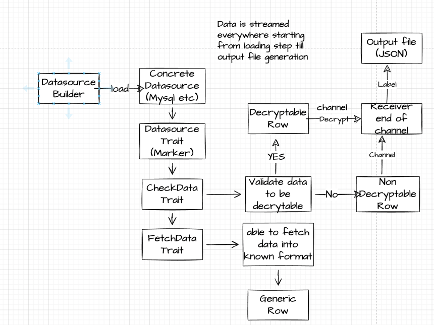

This is a binary crate/utility to decrypt user `PII data` encrypted using `Aes256 algorithm` and `cbc block mode` with `key` generated using external `key generation/management service` like `AWS KMS` and each sensitive data field follows the following sequence during `encryption`
1. ###### Generate Plain Text Key using `AWS_KMS SDK` for client side Encryption
    - ```rust
       async fn make_key(client: &Client, key: &str) -> Result<(), Error> {
           let resp = client
           .generate_data_key()
           .key_id(aws_cmk)
           .key_spec(DataKeySpec::Aes256)
           .encryption_context("id", encryption_context)
           .send()
           .await?;
           let blob = resp.ciphertext_blob.expect("Could not get encrypted text");
           let bytes = blob.as_ref();

           let s = base64::encode(&bytes);
   
           println!();
           println!("Data key:");
           println!("{}", s);

           Ok(())
       }
      ```
   -  ######  For more details on what is cmk, encryption_context etc. can look up here => [AWS_KMS_RUST_SDK_EXAMPLES](https://docs.aws.amazon.com/sdk-for-rust/latest/dg/rust_kms_code_examples.html)

2. ###### Use `Encrypter` library from any language to encrypt using generated key from `step 1`
3. ###### `base64 encode` the `encrypted key` and the `encrypted cipher` text generated from step 1 and step 2 and store them in the database
4. ###### `Decryption` follows the natural reverse order of step 1, 2 and 3

###### Code Structure and Architecture

* `FetchData` trait involves implementing fetching data from a datasource and converting into a valid row format (Generic Row).
* `CheckData` trait involves implementation of checking fetched data validity to proceed to `decryption`.`Generic Row` is transformed here into `Decryptable Row` and `NonDecryptable Row` accordingly.
* `Datasource` is marker trait to identify a valid datasource that implements both `FetchData` and `CheckData` trait.
* `Tokio tasks` are spawned right when `decrypt_data` function is called while streaming data from datasource using iterator which is lazy (does not start execution until `for_each` called here in `decryption` step)
* `Decrypted Data` is sent to main thread via `tokio mpsc unbounded channel`
* `main thread` persists data into `json file` compliant with `JSONObject`'s separated by new line character `\n` that can be read by `Apache Spark's DataFrameReader`

###### How to use this?
   - Application expects proper `env variables` to be defined.See below for more information.
   ```shell
#    application uses `clap` crate, so we can use --help to provide help with parameters required
#   ./target/release/kms_decryption_utility --help
   cargo build --release
   ./target/release/kms_decryption_utility -- -d "<datasource_type>" -q "<query>" -p "<output_path>"
   ```
   - Command line parameters `-d` defaults to `mysql` and `-p` to `data.json`
   - Required param is `-q` or `--query` to provide `abstraction or control` over which data to process
   - Right now concrete datasource implementation is provided for `MySql` datasource
   - It expects the following `variables` to be present in the `env`
      - `MYSQL_USER`
      - `MYSQL_PASSWORD`
      - `MYSQL_HOST_NAME`
      - `MYSQL_PORT`
      - `MYSQL_DATABASE`
   - Can repeat above steps with the provided `Dockerfile` as well


